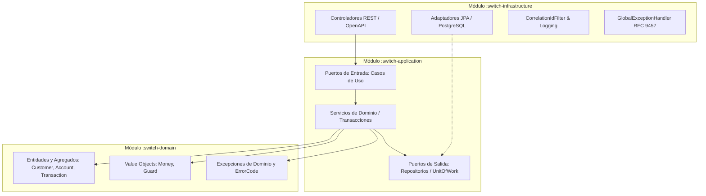
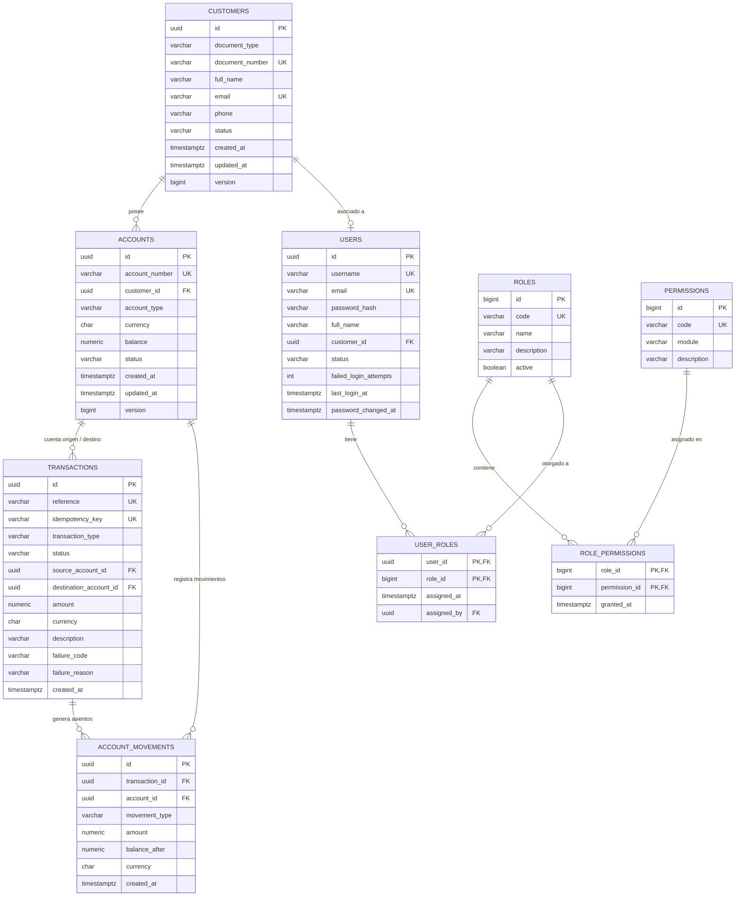

# Switch Transaccional — Solución Bancaria Full Stack

Solución bancaria integral compuesta por una **API REST de alto rendimiento en Java 21 + Spring Boot 3.5** (arquitectura hexagonal, concurrencia pesimista, doble partida ledger, RFC 9457 y seguridad JWT/RBAC) y un **Frontend SPA moderno en Angular 18** (Standalone Components, Signals e interceptores reactivos).

---

### Estructura del Repositorio

```text
prueba-java-transaccional/
├── .github/          # Automatización CI/CD (GitHub Actions para build, tests y deploy)
├── backend/          # API REST, Dominio, Aplicación, Persistencia, Base de Datos, MCP y Postman
│   ├── application/  # Casos de uso y puertos (Hexagonal puro)
│   ├── buildSrc/     # Convenciones de Gradle Kotlin DSL
│   ├── database/     # Scripts SQL deterministas de PostgreSQL (00 al 05)
│   ├── domain/       # Modelos puros, invariantes y Value Objects (Java 21)
│   ├── gradle/       # Gradle Wrapper 9.8
│   ├── infrastructure/ # Controladores Spring MVC, Seguridad JWT y Adaptadores JPA
│   ├── mcp/          # Servidor Model Context Protocol para consultas de base de datos
│   └── postman/      # Colección Postman v2.1 y variables de entorno
├── frontend/         # Aplicación Web SPA en Angular 18 (TypeScript)
│   ├── src/app/core/ # Modelos, interceptores HTTP, guards y servicios de negocio
│   ├── src/app/features/ # Vistas de Login, Dashboard, Clientes, Cuentas y Transacciones
│   └── src/app/shared/ # Componentes compartidos y navegación
└── README.md         # Documentación técnica y guía de puesta en marcha
```

---

## 1. Requisitos del Sistema

- **Java JDK 21+**: Gradle utiliza el Java Toolchain para compilar y ejecutar sobre Java 21 (incluye el plugin Foojay que descarga el JDK automáticamente si no está disponible localmente).
- **PostgreSQL 14+**: Servidor de base de datos relacional con soporte para la extensión `pgcrypto` (incluida en los scripts).
- **Gradle**: **No requiere instalación previa**. Se incluye el Gradle Wrapper (`./gradlew`, versión 9.8).

---

## 2. Puesta a Punto de la Base de Datos

El esquema y los datos iniciales se gestionan de forma determinista mediante scripts SQL ubicados en `database/`. No se utiliza Flyway en tiempo de arranque; la base de datos se valida mediante `spring.jpa.hibernate.ddl-auto: validate`.

### Variables de Entorno de Conexión

Por defecto, la aplicación y los scripts utilizan las siguientes credenciales:

| Variable | Valor por Defecto | Descripción |
|---|---|---|
| `DB_HOST` | `localhost` | Host del servidor PostgreSQL |
| `DB_PORT` | `5432` | Puerto del servidor PostgreSQL |
| `DB_NAME` | `switch_transaccional` | Nombre de la base de datos |
| `DB_USER` | `postgres` | Usuario de base de datos |
| `DB_PASSWORD` | `postgres` | Contraseña del usuario |

### Creación / Reinicio de la Base de Datos

Los scripts eliminan la base si existe (`DROP DATABASE WITH FORCE`), la crean, habilitan `pgcrypto`, crean tablas, secuencias, índices, funciones, triggers, vistas y cargan datos de prueba.

#### En Linux / macOS:
```bash
# Con credenciales por defecto (postgres / postgres):
cd backend/database
chmod +x reset_database.sh
./reset_database.sh

# Personalizando usuario y contraseña:
DB_USER=mi_usuario DB_PASSWORD=mi_clave ./reset_database.sh

# Solo estructura (sin datos de prueba):
./reset_database.sh --sin-datos
```

#### En Windows:
```cmd
cd backend\database
reset_database.bat

:: Personalizando credenciales:
set DB_USER=mi_usuario
set DB_PASSWORD=mi_clave
reset_database.bat

:: Solo estructura:
reset_database.bat --sin-datos
```

---

## 3. Ejecución y Pruebas del Backend

### Ejecutar la Aplicación Backend en Desarrollo
```bash
cd backend
./gradlew :switch-infrastructure:bootRun
```

### Compilar y Empaquetar el JAR Ejecutable
```bash
cd backend
./gradlew build
```
El archivo JAR autoejecutable se generará en:
`backend/infrastructure/build/libs/switch-transaccional.jar`

### Ejecutar el JAR
```bash
java -jar backend/infrastructure/build/libs/switch-transaccional.jar

# Con variables de entorno personalizadas:
DB_HOST=127.0.0.1 DB_USER=postgres DB_PASSWORD=secreto java -jar backend/infrastructure/build/libs/switch-transaccional.jar
```

### Ejecutar la Suite de Tests
```bash
# Ejecutar todos los tests unitarios y de integración de la solución multi-módulo:
cd backend
./gradlew test
```
Los informes HTML detallados de ejecución se generan en:
`backend/infrastructure/build/reports/tests/test/index.html` (y en cada submódulo correspondiente).

---

## 4. Documentación Interactiva y Monitoreo

Una vez iniciada la aplicación en el puerto `8080`:

| Recurso | URL |
|---|---|
| **Swagger UI (OpenAPI 3)** | [http://localhost:8080/swagger-ui.html](http://localhost:8080/swagger-ui.html) |
| **Especificación OpenAPI (JSON)** | [http://localhost:8080/v3/api-docs](http://localhost:8080/v3/api-docs) |
| **Health Check (Spring Boot Actuator)** | [http://localhost:8080/actuator/health](http://localhost:8080/actuator/health) |

---

## 5. Arquitectura del Sistema

El proyecto sigue los principios de la **Arquitectura Hexagonal (Puertos y Adaptadores)**, dividida en 3 módulos Gradle desacoplados:



### Responsabilidades por Módulo

1. **`switch-domain` (Java 21 puro, sin dependencias de frameworks)**:
   - **Modelos**: `Customer`, `Account` (única dueña de su saldo con métodos `credit`, `debit`, `block`, `activate`, `close`), `Transaction`, `Movement` (asiento del ledger), `Money` (Value Object inmutable con escala a 2 decimales y validación ISO-4217).
   - **Invariantes**: `Guard` para validaciones de parámetros y reglas de dominio.
   - **Excepciones**: Jerarquía `DomainException` con catálogo de códigos `ErrorCode` (`InvalidDataException`, `ResourceNotFoundException`, `ConflictException`, `BusinessRuleViolationException`).

2. **`switch-application` (Casos de uso puros, sin Spring)**:
   - **Puertos de entrada**: `DepositUseCase`, `WithdrawalUseCase`, `TransferUseCase`, `AccountCommandUseCase`, `CustomerCommandUseCase`, etc.
   - **Puertos de salida**: `CustomerRepositoryPort`, `AccountRepositoryPort`, `TransactionRepositoryPort`, `MovementRepositoryPort`, `UnitOfWork` (abstracción transaccional agnóstica de frameworks).
   - **Servicios**: `TransactionService`, `AccountService`, `CustomerService`, `TransactionQueryService`.

3. **`switch-infrastructure` (Adaptadores, Spring Boot 3.5, JPA y Web)**:
   - **Adaptadores REST**: `CustomerController`, `AccountController`, `TransactionController` con anotaciones de validación y OpenAPI 3.
   - **Adaptadores de Persistencia**: Entidades JPA sin relaciones navegables cruzadas (`@ManyToOne` evitados para evitar locks innecesarios), repositorios Spring Data con `@Lock(LockModeType.PESSIMISTIC_WRITE)`.
   - **Manejo Global de Errores**: `GlobalExceptionHandler` extiende `ResponseEntityExceptionHandler` y genera respuestas RFC 9457 (`ProblemDetail`) enriquecidas con `code`, `timestamp`, `correlationId` y `errors`.
   - **Logging & Auditoría**: `CorrelationIdFilter` inyecta `X-Correlation-Id` en el MDC de Log4j2.

---

## 6. Modelo Entidad-Relación (Base de Datos)



---

## 7. Decisiones Técnicas y Mecanismos de Consistencia

1. **Idempotencia Garantizada (`Idempotency-Key`)**:
   - Cada operación monetaria recibe opcionalmente o genera la cabecera `Idempotency-Key`.
   - Si la llave ya fue procesada con éxito, la API devuelve la transacción original con estado HTTP **`200 OK`** y la cabecera **`Idempotent-Replayed: true`** (sin duplicar movimientos ni alterar saldos).
   - Si la transacción previa fue rechazada, el reintento devuelve exactamente el mismo error de negocio **`422 Unprocessable Entity`**.
   - Si la misma llave se reutiliza con una operación diferente (distinto monto, cuenta o tipo), el sistema responde con **`409 Conflict`** (`IDEMPOTENCY_KEY_CONFLICT`).

2. **Bloqueo Pesimista Ordenado y Prevención de Deadlocks**:
   - Para evitar condiciones de carrera en operaciones concurrentes sobre la misma cuenta, se adquiere un bloqueo pesimista exclusivo (`SELECT ... FOR UPDATE` mediante `PESSIMISTIC_WRITE`).
   - En **transferencias entre dos cuentas**, se consultan y bloquean ambas cuentas ordenando sus UUIDs de forma determinista (`findAllByIdForUpdate`), previniendo interbloqueos cíclicos (deadlocks) ante solicitudes concurrentes cruzadas (A &rarr; B y B &rarr; A simultáneas).

3. **Ledger Inmutable (Libro Mayor)**:
   - Todo cambio en el saldo de una cuenta genera un registro en `account_movements` con el tipo (`DEBIT` o `CREDIT`), monto y el `balance_after` resultante.
   - Un trigger en PostgreSQL (`trg_protect_ledger`) prohíbe modificaciones (`UPDATE`) o eliminaciones (`DELETE`) sobre esta tabla, asegurando auditabilidad contable total y conciliación matemática perfecta.

4. **Auditoría de Transacciones Rechazadas (`REJECTED`)**:
   - Cuando una operación es rechazada por una regla de negocio (ej. fondos insuficientes o cuenta bloqueada), la transacción de negocio hace rollback del saldo, pero se registra de inmediato un registro en `transactions` con `status = 'REJECTED'`, `failure_code` y `failure_reason` en una transacción independiente (`UnitOfWork`).
   - El fallo de negocio original se propaga íntegro al cliente HTTP sin ser enmascarado.

5. **Respuestas de Error Uniformes (RFC 9457 ProblemDetail)**:
   - Todos los errores devuelven `application/problem+json` con las propiedades estándar (`type`, `title`, `status`, `detail`, `instance`) más atributos corporativos:
     - `code`: Código tipado del error (ej. `INSUFFICIENT_FUNDS`, `CUSTOMER_ALREADY_EXISTS`).
     - `timestamp`: Marca temporal en formato ISO-8601.
     - `correlationId`: Identificador único de seguimiento de la petición.
     - `errors`: Lista detallada de fallos de validación por campo cuando aplica.

6. **Pool de Conexiones HikariCP y Timeout de Bloqueo**:
   - Configurado con `auto-commit: false`, tamaño óptimo de pool y parámetro `options: -c lock_timeout=5000` (5 segundos) para no retener conexiones si una fila está bloqueada por encima del umbral seguro.

7. **Trazabilidad con Log4j2 y CorrelationId**:
   - `CorrelationIdFilter` captura el encabezado `X-Correlation-Id` (o genera uno nuevo vía `UUID.randomUUID()`) y lo vincula al contexto de hilos (`ThreadContext` / MDC).
   - Todos los logs (consola y archivo rotativo en `logs/switch-transaccional.log`) imprimen automáticamente el correlation ID para facilitar el seguimiento distribuido.

8. **Seguridad Stateless con Spring Security, JWT y Control de Acceso Basado en Roles (RBAC)**:
   - Autenticación desacoplada en el dominio (`AuthService`, `LoginUseCase`, `CurrentUserUseCase`) con contraseñas cifradas en BCrypt.
   - Emisión de tokens **JWT** compactos y firmados con HMAC-SHA256 (`jjwt 0.12.6`), con claims estructurados (`sub`, `roles`, `permissions`, `customerId`, `fullName`).
   - Control de acceso granular por método mediante `@EnableMethodSecurity` y `@PreAuthorize("hasAuthority('PERMISO')")` en los endpoints de Clientes, Cuentas y Transacciones.
   - Integración nativa con RFC 9457: los filtros y manejadores de seguridad (`JwtAuthenticationEntryPoint`, `JwtAccessDeniedHandler`, `GlobalExceptionHandler`) transforman excepciones de seguridad (`401 Unauthorized`, `403 Forbidden`, `USER_LOCKED`) en objetos `ProblemDetail` idénticos a los del resto de la API.
   - Bloqueo preventivo automático: tras 5 intentos fallidos de autenticación consecutivos, la función de base de datos `fn_register_failed_login` pasa al usuario a estado `LOCKED`.

---

## 8. Catálogo de Endpoints REST

Prefijo base: `/api/v1`

### Autenticación (`/api/v1/auth`)
| Método | Ruta | Descripción | Respuestas |
|---|---|---|---|
| `POST` | `/api/v1/auth/login` | Iniciar sesión y emitir token JWT | `200 OK`, `400`, `401 Unauthorized`, `403 Forbidden` (bloqueado) |
| `GET` | `/api/v1/auth/me` | Obtener datos, roles y permisos del usuario autenticado | `200 OK`, `401 Unauthorized` |

### Clientes (`/api/v1/customers`)
| Método | Ruta | Descripción | Respuestas |
|---|---|---|---|
| `POST` | `/api/v1/customers` | Registrar un nuevo cliente (`CUSTOMER_CREATE`) | `201 Created`, `400`, `409` |
| `GET` | `/api/v1/customers` | Listar clientes (`CUSTOMER_READ`) | `200 OK` |
| `GET` | `/api/v1/customers/{id}` | Obtener cliente por ID (`CUSTOMER_READ`) | `200 OK`, `404` |
| `PUT` | `/api/v1/customers/{id}` | Actualizar contacto (`CUSTOMER_UPDATE`) | `200 OK`, `400`, `404`, `409` |
| `DELETE` | `/api/v1/customers/{id}` | Inactivar cliente (`CUSTOMER_DELETE`) | `204 No Content`, `404`, `422` |

### Cuentas (`/api/v1/accounts`)
| Método | Ruta | Descripción | Respuestas |
|---|---|---|---|
| `POST` | `/api/v1/accounts` | Apertura de cuenta (`ACCOUNT_CREATE`) | `201 Created`, `400`, `404`, `422` |
| `GET` | `/api/v1/accounts` | Listar cuentas (`ACCOUNT_READ`) | `200 OK` |
| `GET` | `/api/v1/accounts/{id}` | Consultar detalle y saldo (`ACCOUNT_READ`) | `200 OK`, `404` |
| `GET` | `/api/v1/accounts/{id}/movements` | Consultar ledger paginado (`ACCOUNT_READ`) | `200 OK`, `404` |
| `PATCH` | `/api/v1/accounts/{id}/status` | Bloquear/reactivar cuenta (`ACCOUNT_UPDATE_STATUS`) | `200 OK`, `400`, `404`, `422` |
| `DELETE` | `/api/v1/accounts/{id}` | Cerrar cuenta (`ACCOUNT_CLOSE`) | `204 No Content`, `404`, `422` |

### Transacciones (`/api/v1/transactions`)
| Método | Ruta | Descripción | Respuestas |
|---|---|---|---|
| `POST` | `/api/v1/transactions/deposits` | Realizar depósito (`TRANSACTION_DEPOSIT`) | `201 Created`, `200 OK` (replay), `400`, `404`, `409`, `422` |
| `POST` | `/api/v1/transactions/withdrawals` | Realizar retiro (`TRANSACTION_WITHDRAW`) | `201 Created`, `200 OK` (replay), `400`, `404`, `409`, `422` |
| `POST` | `/api/v1/transactions/transfers` | Transferencia entre cuentas (`TRANSACTION_TRANSFER`) | `201 Created`, `200 OK` (replay), `400`, `404`, `409`, `422` |
| `GET` | `/api/v1/transactions/{id}` | Consultar transacción (`TRANSACTION_READ`) | `200 OK`, `404` |
| `GET` | `/api/v1/transactions` | Listar transacciones (`TRANSACTION_READ`) | `200 OK` |

---

## 9. Catálogo de Códigos de Error (`ErrorCode`)

| Código | HTTP Status | Descripción |
|---|---|---|
| `VALIDATION_ERROR` | `400 Bad Request` | Fallo de validación de campos en la petición (Bean Validation) |
| `INVALID_REQUEST` | `400 Bad Request` | Parámetros inválidos o formato no interpretable |
| `INVALID_AMOUNT` | `400 Bad Request` | Monto negativo, nulo o con más de dos decimales |
| `INVALID_CURRENCY` | `400 Bad Request` | Moneda no cumple el estándar ISO-4217 |
| `UNAUTHORIZED` | `401 Unauthorized` | Petición sin token JWT o token expirado/inválido |
| `INVALID_CREDENTIALS` | `401 Unauthorized` | Usuario o contraseña incorrectos en el login |
| `FORBIDDEN` | `403 Forbidden` | El usuario no cuenta con el permiso / autoridad requerida |
| `USER_LOCKED` | `403 Forbidden` | La cuenta de usuario se encuentra bloqueada |
| `CUSTOMER_NOT_FOUND` | `404 Not Found` | El cliente solicitado no existe |
| `ACCOUNT_NOT_FOUND` | `404 Not Found` | La cuenta solicitada no existe |
| `TRANSACTION_NOT_FOUND` | `404 Not Found` | La transacción solicitada no existe |
| `CUSTOMER_ALREADY_EXISTS` | `409 Conflict` | Documento o correo electrónico ya registrado |
| `IDEMPOTENCY_KEY_CONFLICT` | `409 Conflict` | Llave de idempotencia reutilizada con una operación diferente |
| `CONCURRENCY_CONFLICT` | `409 Conflict` | Conflicto de bloqueo optimista o pesimista concurrente |
| `DATA_INTEGRITY_VIOLATION` | `409 Conflict` | Violación de restricción de integridad en base de datos |
| `CUSTOMER_INACTIVE` | `422 Unprocessable` | El cliente se encuentra inactivo para realizar la operación |
| `CUSTOMER_HAS_OPEN_ACCOUNTS` | `422 Unprocessable` | No se puede inactivar un cliente con cuentas abiertas |
| `ACCOUNT_NOT_ACTIVE` | `422 Unprocessable` | La cuenta está bloqueada o cerrada |
| `ACCOUNT_BALANCE_NOT_ZERO` | `422 Unprocessable` | La cuenta debe tener saldo 0.00 para poder cerrarse |
| `INVALID_STATUS_TRANSITION` | `422 Unprocessable` | Transición de estado no permitida para la cuenta o cliente |
| `INSUFFICIENT_FUNDS` | `422 Unprocessable` | Saldo insuficiente en la cuenta para debitar el monto |
| `CURRENCY_MISMATCH` | `422 Unprocessable` | La divisa de la transacción no coincide con la de la cuenta |
| `SAME_ACCOUNT_TRANSFER` | `422 Unprocessable` | La cuenta de origen y de destino no pueden ser iguales |
| `SERVICE_UNAVAILABLE` | `503 Service Unavailable`| Base de datos o servicio externo no disponible |
| `INTERNAL_ERROR` | `500 Internal Server Error`| Error inesperado del servidor |

---

## 10. Datos y Usuarios de Prueba (Seed)

La base de datos se inicializa con los siguientes usuarios y cuentas:

### Usuarios del Sistema (Contraseñas con Hash Bcrypt)
| Usuario | Contraseña | Rol | Descripción |
|---|---|---|---|
| `admin` | `Admin123*` | `ADMIN` | Acceso y privilegios totales en todo el switch |
| `operador` | `Operador123*` | `OPERATOR` | Gestión operativa de clientes, cuentas y transacciones |
| `auditor` | `Auditor123*` | `AUDITOR` | Consultas de solo lectura, reportes y conciliaciones |
| `ana.perez` | `Cliente123*` | `CUSTOMER` | Titular (asociada a la cliente Ana María Pérez) |
| `bloqueado` | `Bloqueado123*` | `OPERATOR` | Usuario en estado `LOCKED` (5 intentos fallidos) |

### Control de Acceso Basado en Roles (RBAC Parametrizado)

El esquema de autorización está **completamente parametrizado en base de datos** mediante las tablas `roles`, `permissions` y `role_permissions`. Esto permite modificar asignaciones o crear nuevos perfiles sin alterar el código Java ni requerir re-despliegues.

#### Alcance por Rol:
- **`ADMIN`**: Privilegios totales. Administra seguridad (`USER_MANAGE`, `ROLE_MANAGE`), operaciones de negocio y auditoría.
- **`OPERATOR`**: Cajero / Operador bancario. Gestiona clientes (creación, edición, baja), apertura/bloqueo/cierre de cuentas y procesa transacciones (depósitos, retiros y transferencias).
- **`AUDITOR`**: Perfil de supervisión y cumplimiento normativo. Exclusivamente lectura (`*_READ`) y visualización de reportes (`REPORT_VIEW`). Cualquier operación de escritura responderá con `403 Forbidden`.
- **`CUSTOMER`**: Canal de autoservicio bancario. Puede consultar sus cuentas, ver su extracto/movimientos contables y realizar transferencias hacia otras cuentas. No puede crear clientes ni cuentas de ventanilla.

#### Matriz de Permisos por Rol:

| Módulo / Acción | Permiso | `ADMIN` | `OPERATOR` | `AUDITOR` | `CUSTOMER` |
|---|---|:---:|:---:|:---:|:---:|
| **Consultar clientes** | `CUSTOMER_READ` |  |  |  | ❌ |
| **Registrar clientes** | `CUSTOMER_CREATE` |  |  | ❌ | ❌ |
| **Actualizar clientes** | `CUSTOMER_UPDATE` |  |  | ❌ | ❌ |
| **Inactivar clientes** | `CUSTOMER_DELETE` |  |  | ❌ | ❌ |
| **Consultar cuentas / movimientos** | `ACCOUNT_READ` |  |  |  |  |
| **Abrir cuentas** | `ACCOUNT_CREATE` |  |  | ❌ | ❌ |
| **Bloquear / reactivar cuentas** | `ACCOUNT_UPDATE_STATUS`|  |  | ❌ | ❌ |
| **Cerrar cuentas** | `ACCOUNT_CLOSE` |  |  | ❌ | ❌ |
| **Consultar transacciones** | `TRANSACTION_READ` |  |  |  |  |
| **Realizar depósitos** | `TRANSACTION_DEPOSIT` |  |  | ❌ | ❌ |
| **Realizar retiros** | `TRANSACTION_WITHDRAW` |  |  | ❌ | ❌ |
| **Realizar transferencias** | `TRANSACTION_TRANSFER` |  |  | ❌ |  |
| **Administrar usuarios** | `USER_MANAGE` |  | ❌ | ❌ | ❌ |
| **Ver reportes / conciliación** | `REPORT_VIEW` |  | ❌ |  | ❌ |

### Cuentas Bancarias del Seed
| Número de Cuenta | UUID de Cuenta | Titular | Tipo | Moneda | Saldo Inicial | Estado |
|---|---|---|---|---|---|---|
| `1000000001` | `b0000000-0000-4000-8000-000000000001` | Ana María Pérez | `SAVINGS` | `COP` | `$2.000.000,00` | `ACTIVE` |
| `1000000002` | `b0000000-0000-4000-8000-000000000002` | Ana María Pérez | `CHECKING` | `USD` | `$1.500,00` | `ACTIVE` |
| `1000000003` | `b0000000-0000-4000-8000-000000000003` | Carlos Andrés Gómez | `SAVINGS` | `COP` | `$600.000,00` | `ACTIVE` |
| `1000000004` | `b0000000-0000-4000-8000-000000000004` | Tech Solutions SAS | `CHECKING` | `COP` | `$3.750.000,00` | `ACTIVE` |
| `1000000005` | `b0000000-0000-4000-8000-000000000005` | Carlos Andrés Gómez | `SAVINGS` | `COP` | `$300.000,00` | `BLOCKED` |

---

## 11. Colección y Entorno de Postman

En la carpeta `backend/postman/` se encuentran los archivos listos para importar en Postman:

- **Colección**: `backend/postman/Switch-Transaccional.postman_collection.json` (formato v2.1.0, organizada en carpetas *Autenticación*, *Clientes*, *Cuentas*, *Transacciones* y *Casos de error*).
  - Incluye autenticación Bearer a nivel de colección referenciando `{{jwtToken}}`.
  - La petición inicial `POST /api/v1/auth/login` (Admin/Operador) almacena automáticamente el token JWT en el entorno (`jwtToken`).
  - Los endpoints de transacciones generan dinámicamente cabeceras `Idempotency-Key` mediante `{{$guid}}`.
  - Scripts de test automáticos que verifican códigos de estado HTTP, contratos JSON y ProblemDetail RFC 9457, actualizando variables (`customerId`, `accountId`, `transactionId`).
- **Entorno Local**: `backend/postman/local.postman_environment.json` (con `baseUrl = http://localhost:8080`, `jwtToken` y los UUIDs del seed listos para usar).

---

## 12. Frontend Angular 18 — Puesta en Marcha

El frontend es una aplicación web SPA interactiva desarrollada en **Angular 18**:
* **Arquitectura Standalone**: Componentes modernos (`standalone: true`), rutas declarativas y Signal APIs de Angular sin módulos NgModule obsoletos.
* **Seguridad y Sesión JWT**: Gestión de sesión en cliente, guard de rutas (`authGuard`) y un `authInterceptor` que inyecta automáticamente la cabecera `Authorization: Bearer <token>` y un UUID único en `X-Correlation-Id`.
* **Idempotencia Garantizada**: En cada operación de dinero (depósito, retiro o transferencia) genera automáticamente una cabecera `Idempotency-Key` aleatoria (`crypto.randomUUID()`) previniendo dobles cargos por reintentos de red o clics repetidos.
* **Manejo de Errores RFC 9457**: Intercepta respuestas `ProblemDetail` (códigos 400, 401, 403, 409, 422) y muestra mensajes legibles al usuario con el motivo del rechazo.
* **Historial con Scroll Infinito**: Tabla de movimientos y transacciones que muestra inicialmente 8 registros y carga reactivamente los siguientes bloques al desplazarse verticalmente.
* **Notificaciones Toast y Confirmaciones**: Sistema de alertas flotantes reactivo con Angular Signals (`success`, `error`, `warning`, `info`) y toasts interactivos de confirmación con botones de acción para operaciones críticas (baja de cliente, bloqueo/activación/cierre de cuenta, retiros y transferencias).
* **Acceso Demo Rápido**: En la pantalla de login se incluyen botones de acceso directo para ingresar con cualquiera de los perfiles del sistema (`admin`, `operador`, `auditor`, `ana.perez`, `bloqueado`).

### Requisitos del Frontend
* **Node.js**: v18+ o v22 LTS (recomendado).
* **NPM**: v10+.

### Ejecución en Modo Desarrollo
```bash
cd frontend
npm install
npm start
```
La aplicación web quedará disponible en:
👉 **[http://localhost:4200](http://localhost:4200)**

### Compilación para Producción
```bash
cd frontend
npm run build
```
Los artefactos estáticos optimizados se generarán en `frontend/dist/frontend/browser/`.

---

## 13. Guía de Inicio Rápido (Levantar Todo Localmente)

Para levantar el ecosistema completo en tu máquina local:

```bash
# Paso 1: Crear o reiniciar la base de datos PostgreSQL con los datos de prueba
cd backend/database
./reset_database.sh    # En Windows: reset_database.bat
cd ../..

# Paso 2: Iniciar el Backend (Spring Boot en http://localhost:8080)
cd backend
./gradlew :switch-infrastructure:bootRun

# Paso 3: En otra terminal, iniciar el Frontend (Angular en http://localhost:4200)
cd frontend
npm start

# Paso 4: Abrir en el navegador:
# Frontend SPA:   http://localhost:4200
# Swagger UI:     http://localhost:8080/swagger-ui.html
# Actuator Check: http://localhost:8080/actuator/health
```


